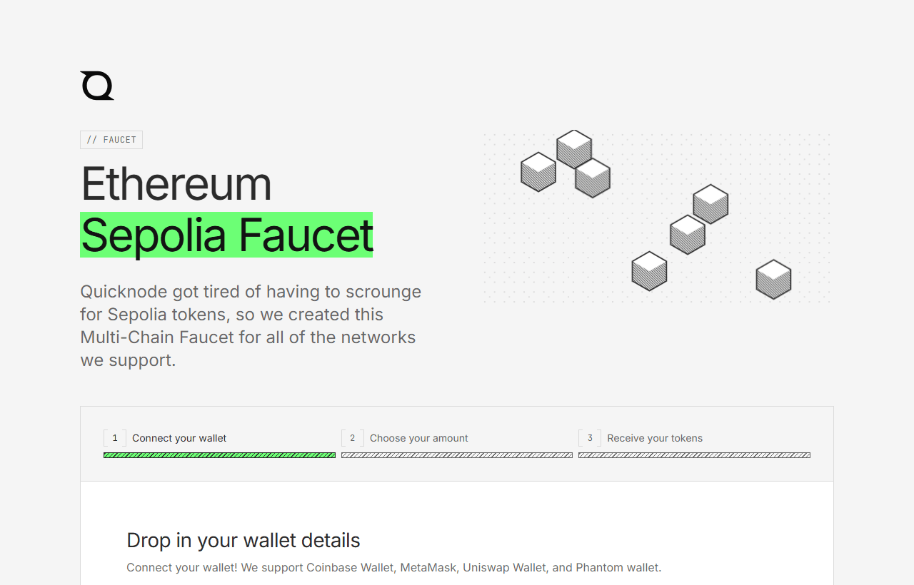

# 01 · Setup and networks

Finish everything here before Day 2: tools, accounts, a testnet, test tokens, and the starter running on your laptop. Installs and faucet waits are the most common way teams lose their build morning, so split the list across teammates.

## On every laptop

- [ ] Chrome, Brave or Edge with the **MetaMask** extension ([metamask.io](https://metamask.io))
- [ ] MetaMask → Settings → Advanced → turn on **Show test networks**
- [ ] A **new wallet just for the hackathon** (a "burner"). Never import a wallet that has held real money
- [ ] **Python 3.10 or newer**: `python --version`
- [ ] **Git**: `git --version`
- [ ] **VS Code** (or any editor)

## Accounts (one per team is enough, all free)

| Service | What for |
| --- | --- |
| [GitHub](https://github.com) | Your repo and your submission |
| [Render](https://render.com) | Hosts the Flask backend |
| [Vercel](https://vercel.com) or [Netlify](https://netlify.com) | Hosts the frontend |
| [Neon](https://neon.tech) or [Supabase](https://supabase.com) | Free Postgres, so deployed records survive restarts |
| [UptimeRobot](https://uptimerobot.com) | Keeps the free backend awake |
| An AI provider | An API key, only if your idea uses AI |

## Test tokens

- [ ] Pick your network ([Networks and faucets](#networks-and-faucets)). If unsure: **Ethereum Sepolia**
- [ ] Every wallet that sends transactions holds test tokens, **including the backend's wallet**. Around 0.05 Sepolia ETH (or 0.5 POL on Amoy) is plenty for a whole day of testing
- [ ] One teammate who gets tokens can share them: MetaMask → Send → paste address. It arrives in seconds

## Clone the starter

```bash
git clone https://github.com/murthyroshan/innoblock-2.0-starter.git
cd innoblock-2.0-starter/backend
python -m venv venv
venv\Scripts\activate            # Mac/Linux: source venv/bin/activate
pip install -r requirements.txt
```

If `pip install` works tonight, it will work tomorrow.

## 10-minute self-test

1. Open the contract in Remix with this [one-click link](https://remix.ethereum.org/#url=https://raw.githubusercontent.com/murthyroshan/innoblock-2.0-starter/main/contracts/RecordRegistry.sol).
2. **Solidity compiler** tab → **Compile RecordRegistry.sol**.
3. **Deploy & run transactions** tab → Environment: **Browser Extension**, then **MetaMask** → approve the connection → check MetaMask shows your testnet.
4. **Deploy** → confirm in MetaMask.
5. Open the transaction from MetaMask's **Activity** tab on the block explorer.

If you see your contract creation on the explorer, your laptop and wallet are ready. Keep the address: you can use this deployment tomorrow. Screenshots of each Remix step are in [02 · Build](02-build.md#step-1--deploy-the-contract-remix).

## Networks and faucets

Any public **testnet** is allowed. The starter supports five EVM testnets out of the box. If you're unsure, use **Ethereum Sepolia**: it has the most faucets, tutorials and mentor experience.

### Supported networks

| Network | Chain ID (hex) | Currency | Public RPC | Explorer |
| --- | --- | --- | --- | --- |
| **Ethereum Sepolia** | 11155111 (`0xaa36a7`) | ETH | `https://ethereum-sepolia-rpc.publicnode.com` | [sepolia.etherscan.io](https://sepolia.etherscan.io) |
| **Base Sepolia** | 84532 (`0x14a34`) | ETH | `https://base-sepolia-rpc.publicnode.com` | [sepolia.basescan.org](https://sepolia.basescan.org) |
| **Polygon Amoy** | 80002 (`0x13882`) | POL | `https://polygon-amoy-bor-rpc.publicnode.com` | [amoy.polygonscan.com](https://amoy.polygonscan.com) |
| **Arbitrum Sepolia** | 421614 (`0x66eee`) | ETH | `https://arbitrum-sepolia-rpc.publicnode.com` | [sepolia.arbiscan.io](https://sepolia.arbiscan.io) |
| **OP Sepolia** | 11155420 (`0xaa37dc`) | ETH | `https://optimism-sepolia-rpc.publicnode.com` | [sepolia-optimism.etherscan.io](https://sepolia-optimism.etherscan.io) |

> **Don't use Goerli or Mumbai.** Goerli was shut down in April 2024. Polygon Mumbai was deprecated on 13 April 2024 and replaced by **Polygon Amoy**. Old tutorials still mention both.

### Switching the starter to another network

The same contract works on every network. Change three places:

1. **Remix**: switch MetaMask to the network, then deploy `RecordRegistry.sol` again. Each network gets its own contract address.
2. **`backend/.env`**: set `RPC_URL`, `CONTRACT_ADDRESS` and `EXPLORER_URL` for that network (examples are in `.env.example`).
3. **`frontend/config.js`**: set `ACTIVE_NETWORK` (for example `"baseSepolia"`) and `CONTRACT_ADDRESS`.

The frontend asks MetaMask to switch network automatically, and adds the network to MetaMask if it isn't there yet.

#### Any other EVM testnet

Add an entry to `NETWORKS` in `frontend/config.js` with its name, chain ID, RPC URL, explorer and currency. Look up the details on [chainlist.org](https://chainlist.org) (tick "Include testnets").

#### Non-EVM chains

Other testnets (Solana devnet and so on) are allowed, but this starter and its guides only cover EVM chains.

### Faucets

Many faucets now ask for a small **real** balance on Ethereum mainnet, which a new hackathon wallet doesn't have. These ones work without it:

| Network | Faucets that work with a new wallet |
| --- | --- |
| **Ethereum Sepolia** | [QuickNode](https://faucet.quicknode.com/ethereum/sepolia) (no account) · [Google Cloud](https://cloud.google.com/application/web3/faucet/ethereum/sepolia) (Google account) · [PoW faucet](https://sepolia-faucet.pk910.de) (no account; you "mine" in a browser tab, so leave it running) |
| **Base Sepolia** | [QuickNode](https://faucet.quicknode.com/base/sepolia) · [Coinbase Developer Platform](https://portal.cdp.coinbase.com/products/faucet) (free developer account) |
| **Polygon Amoy** | [QuickNode](https://faucet.quicknode.com/polygon/amoy) · [Polygon faucet](https://faucet.polygon.technology) |
| **Arbitrum Sepolia** | [QuickNode](https://faucet.quicknode.com/arbitrum/sepolia) |
| **OP Sepolia** | [QuickNode](https://faucet.quicknode.com/optimism/sepolia) |



QuickNode gives one claim every 12 hours per wallet per network. **If every faucet fails**, ask a teammate or another team to send you some (MetaMask → Send), or ask the organisers on Day 1, not on Day 2. Faucet rules change often; these were checked on 4 October 2026.

### Wallet

Use **MetaMask**: the starter and every guide assume it. Turn on **Show test networks** in Settings → Advanced.

**One wallet extension at a time.** If several are installed they fight over `window.ethereum` and the wrong popup opens. Disable the others before you demo.

**On a phone**, `window.ethereum` only exists inside a wallet's built-in browser. Open your app's URL from the MetaMask app's browser tab.
