# 02 · Build

How the starter works, how to turn it into your project step by step, and prompts for AI coding assistants.

## How the starter works

The demo app is a "proof registry": store a fingerprint of any text on-chain, then prove later that the text was never changed. It already shows wallet connection, transaction status, an AI step and verification, so you can reshape it into your project instead of starting from zero.

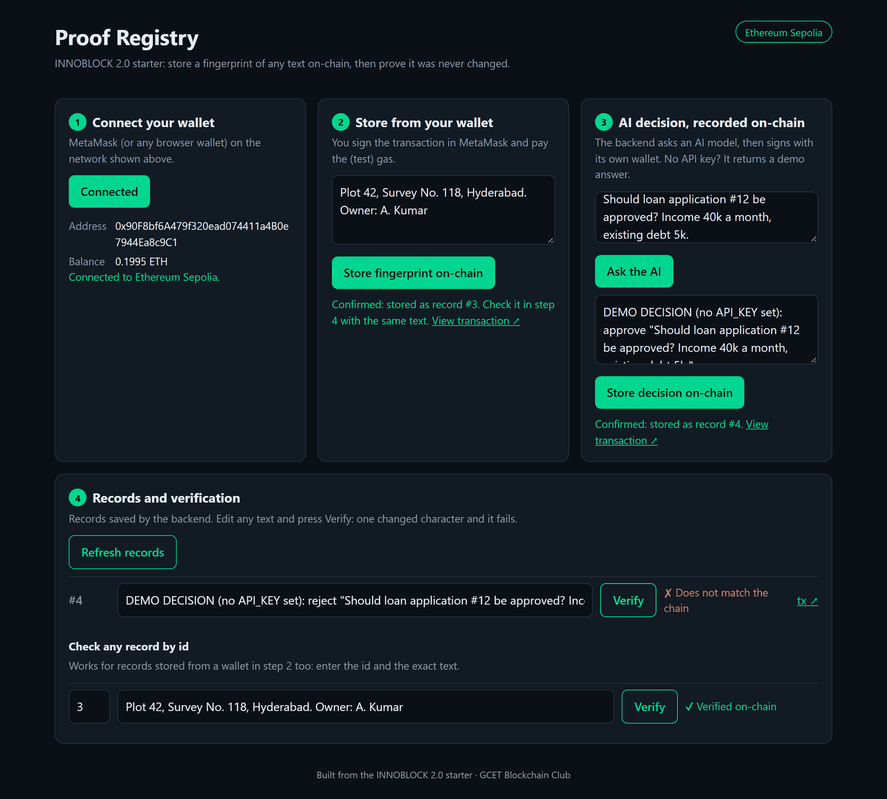

The browser talks to the chain directly; the backend only does what needs a secret (a private key or an AI API key).

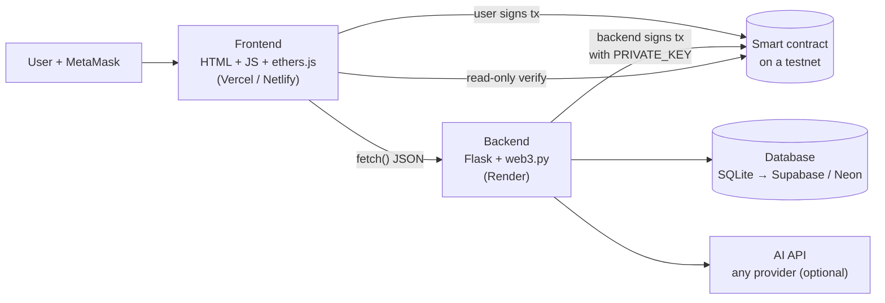

### The pattern: full record off-chain, fingerprint on-chain

Blockchains are public, permanent and expensive per byte. So store the **full record** in your database and only its **SHA-256 hash** (32 bytes) on-chain. Anyone can later re-hash the record and compare: if one character changed, the hashes don't match.

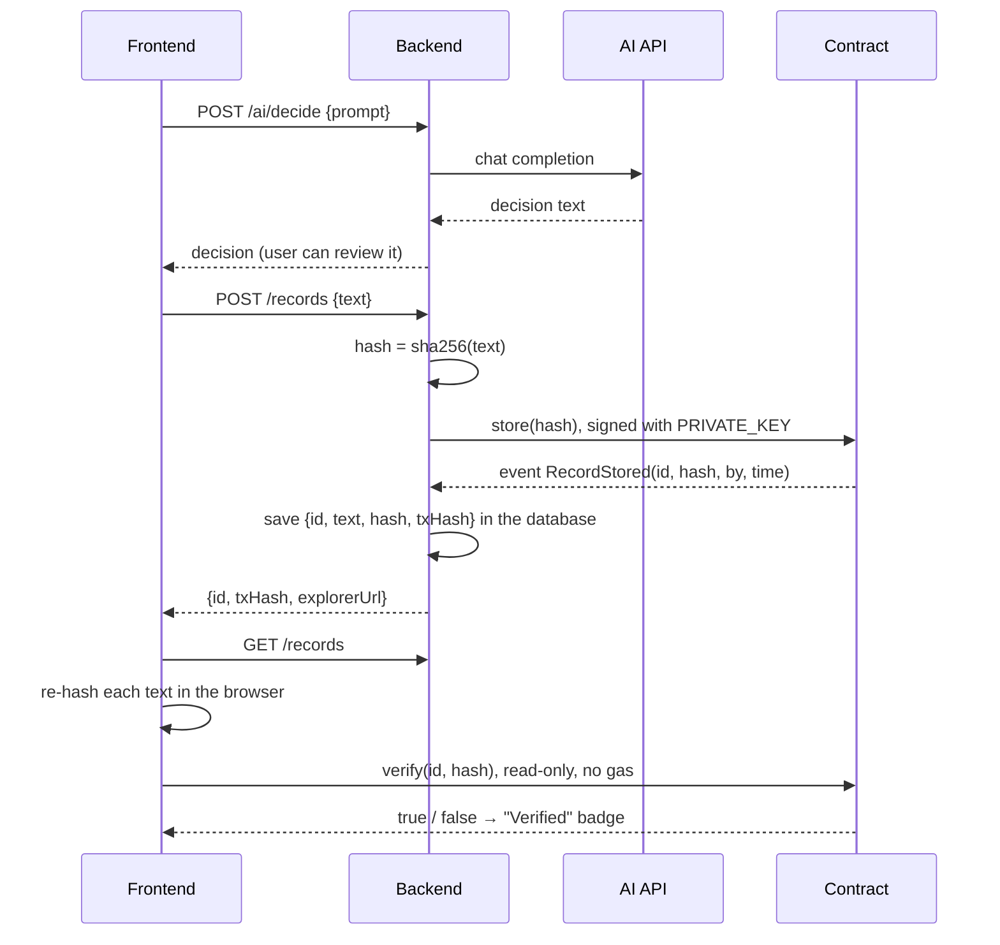

The hash is computed the same way on both sides, so it always matches for the same text:

- Python: `"0x" + hashlib.sha256(text.encode("utf-8")).hexdigest()`
- JavaScript: `ethers.sha256(ethers.toUtf8Bytes(text))`

You can't recover the text from a hash. That's why the backend saves the full record.

### Two ways to write to the chain

| | User signs (step 2 in the app) | Backend signs (step 3 in the app) |
| --- | --- | --- |
| Who pays gas | The user's wallet | The backend's burner wallet |
| Signed by | MetaMask popup | `PRIVATE_KEY` in `backend/.env` |
| Use when | The user is the one acting: registering, buying, voting, transferring | The app acts on its own: logging an AI decision, an oracle result, an admin record |
| `msg.sender` in the contract | The user's address | The backend's address |

Many projects use both. Ownership and votes should come from the user's wallet; automated records from the backend.

### Backend API

| Route | Body | Returns |
| --- | --- | --- |
| `GET /health` | | `{ok, chainId, block, wallet, contract}` |
| `POST /ai/decide` | `{"prompt": "..."}` | `{decision, demo}`. `demo: true` means no `API_KEY` is set |
| `POST /records` | `{"text": "..."}` | `{id, text, hash, txHash, explorerUrl}` once mined |
| `GET /records` | | `{records: [...]}`, newest first |

Errors always come back as JSON: `{"error": "readable message"}` with a 4xx or 5xx status.

The AI route speaks the **OpenAI-compatible chat API**, which most providers offer (OpenAI, Groq, Gemini, OpenRouter, Anthropic, local Ollama). Switch provider by changing `API_KEY`, `AI_BASE_URL` and `AI_MODEL` in `.env`. Edit `AI_SYSTEM_PROMPT` to shape the answers for your idea.

### Files

| File | What it does | You'll change it when |
| --- | --- | --- |
| `contracts/RecordRegistry.sol` | Stores a hash per id, emits `RecordStored`, verifies | Your idea needs different data or rules |
| `backend/app.py` | API routes, hashing, signing, database | You add routes or change what's stored |
| `backend/abi.json` | The contract's interface, for web3.py | You change the contract (copy the ABI from Remix) |
| `backend/.env` | Secrets and settings (git-ignored) | Always: create it from `.env.example` |
| `frontend/config.js` | Network, contract address, backend URL, ABI | Always: and whenever the contract changes |
| `frontend/app.js` | Wallet connection, transactions, verification | You change the user flow |
| `frontend/index.html`, `style.css` | The page | You make it look like your product |

### Contract walkthrough

```solidity
event RecordStored(uint256 indexed id, bytes32 hash, address indexed by, uint256 time);
mapping(uint256 => bytes32) public records;   // id => hash
uint256 public count;                         // ids start at 1

function store(bytes32 hash) external returns (uint256 id)        // anyone can store
function verify(uint256 id, bytes32 hash) external view returns (bool)   // free to call
```

- **Events** are cheap, permanent logs. The frontend reads the new id from the event; the explorer shows them under "Logs".
- **`view` functions** cost no gas when called from outside, so verification is free.
- **Anyone can call `store`.** That's fine for a demo. To let only your backend write, add an `owner` set in the constructor and `require(msg.sender == owner)` in `store`.

## Step by step

Get the starter running first, then change it into your idea one piece at a time. Don't start a step until the previous one passes its check: most failed demos come from wiring everything at once in the evening.

### Split the team

| Team of | Roles |
| --- | --- |
| 4 | Contract + deployment · backend · frontend · README, slides and pitch from the start |
| 3 | Contract + backend · frontend · deployment + README + pitch |
| 2 | Contract + backend · frontend + pitch |

Everyone builds against the deployed contract, so **agree on its functions early**. Every redeploy means a new address and a new ABI in three places.

### Step 1 · Deploy the contract (Remix)

1. **Open the contract in Remix:** [one-click link](https://remix.ethereum.org/#url=https://raw.githubusercontent.com/murthyroshan/innoblock-2.0-starter/main/contracts/RecordRegistry.sol). It loads `RecordRegistry.sol` straight from this repo. (Or open [remix.ethereum.org](https://remix.ethereum.org), create `RecordRegistry.sol` and paste the file's contents.) Close any welcome pop-ups.
2. **Compile:** open the **Solidity compiler** tab (left bar) and press **Compile RecordRegistry.sol**. A green tick appears on the tab icon. The **ABI** button at the bottom copies the contract's interface; you'll need it if you change the contract.

    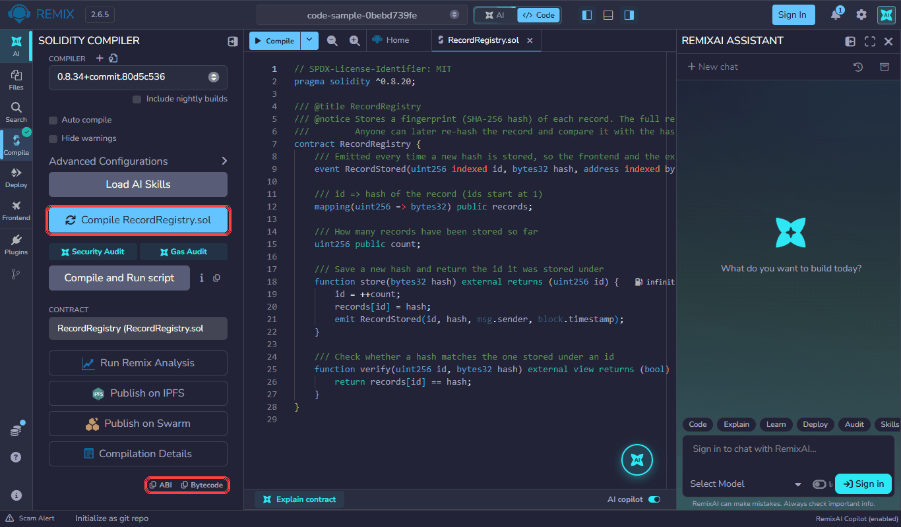

3. **Choose your wallet:** open the **Deploy & run transactions** tab. Set **Environment** to **Browser Extension**, then pick **MetaMask** in the second dropdown. MetaMask asks to connect: approve it, and check MetaMask is on your testnet.

    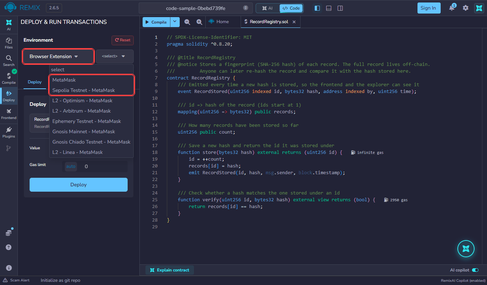

4. **Deploy:** press **Deploy** and confirm in MetaMask. When it's mined, the contract appears under **Deployed Contracts**: copy its address with the copy icon.

    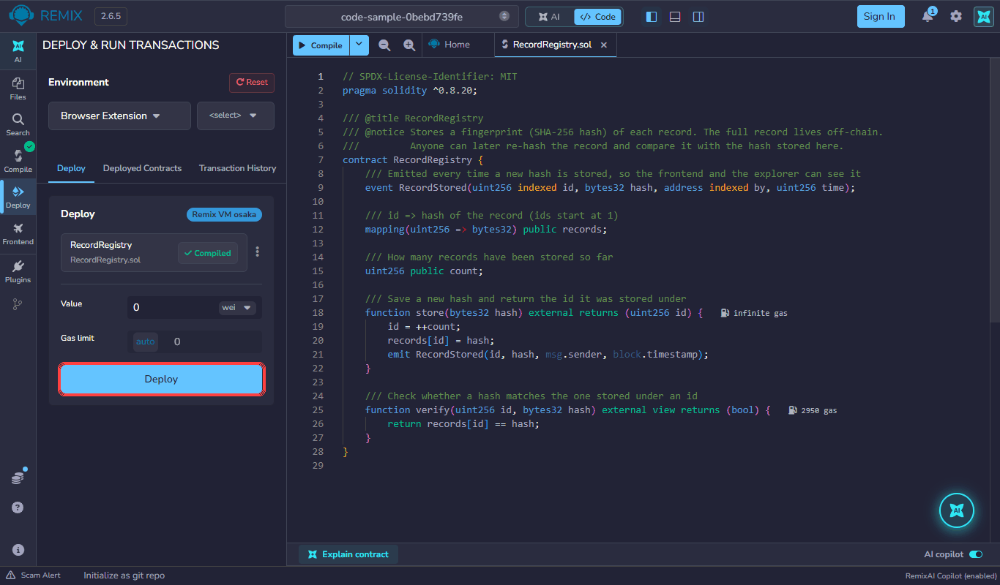

**Done when** the contract-creation transaction shows on your network's explorer (open it from MetaMask → Activity).

> Remix's default compiler settings target the newest Ethereum upgrade. If deployment fails on an L2 testnet with an "invalid opcode" error, open **Advanced Configurations** in the compiler tab, set **EVM version** to `cancun`, recompile and redeploy.

### Step 2 · Verify the contract on the explorer

On the explorer, open your contract address → **Contract** → **Verify and Publish**:

- Compiler type: **Solidity (Single file)**
- Compiler version: exactly the one Remix used
- License: MIT
- Optimisation: the same as in Remix (off by default)
- Paste the source and submit

Or use Remix's **Contract Verification** plugin. **Done when** the contract page shows a green tick and **Read / Write Contract** tabs. Judges look for this.

### Step 3 · Run the backend

```bash
cd backend
python -m venv venv
venv\Scripts\activate            # Mac/Linux: source venv/bin/activate
pip install -r requirements.txt
copy .env.example .env           # Mac/Linux: cp .env.example .env
```

Fill in `.env`:

| Variable | Where it comes from |
| --- | --- |
| `PRIVATE_KEY` | MetaMask → your **burner** account → Account details → Show private key. Fund this wallet: it pays gas for step 3 in the app |
| `RPC_URL` | A public RPC from [01 · Setup and networks](01-setup.md#networks-and-faucets), or your Alchemy / Infura URL |
| `CONTRACT_ADDRESS` | From step 1 |
| `EXPLORER_URL` | The explorer for your network, e.g. `https://sepolia.basescan.org` |
| `DATABASE_URL` | Leave empty locally (records go in a SQLite file). Set it when you deploy |
| `API_KEY`, `AI_BASE_URL`, `AI_MODEL` | Optional. Leave `API_KEY` empty to get demo answers |

```bash
python app.py
```

**Done when** [http://localhost:5000/health](http://localhost:5000/health) shows `"ok": true` with your network's `chainId`, your contract and the backend wallet's address:

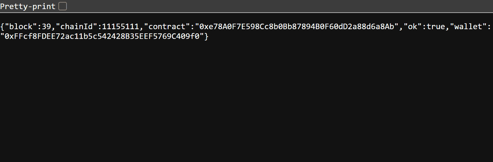

### Step 4 · Run the frontend

Edit [`frontend/config.js`](../frontend/config.js): set `ACTIVE_NETWORK` and `CONTRACT_ADDRESS`. Leave `BACKEND_URL` as `http://localhost:5000` for now.

```bash
cd frontend
python -m http.server 8000
```

Open [http://localhost:8000](http://localhost:8000). Don't double-click `index.html`: wallets don't work on `file://` pages.

**Done when** all four steps on the page work:

1. **Connect** shows your address, your balance and the network.

    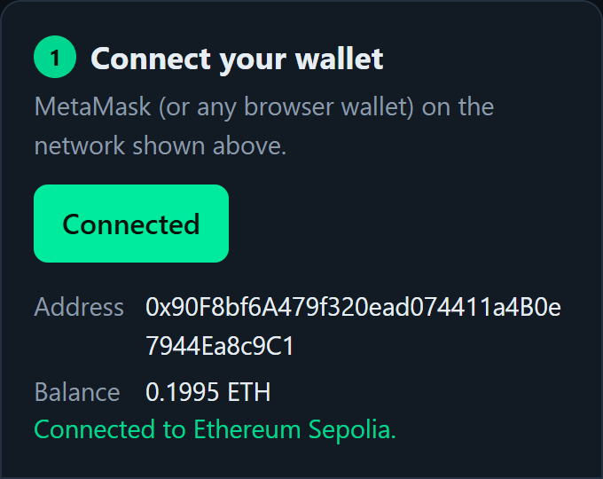

2. **Store from your wallet**: MetaMask asks you to confirm, the status turns **Pending** with a link to the transaction, then **Confirmed** with the record's id.

    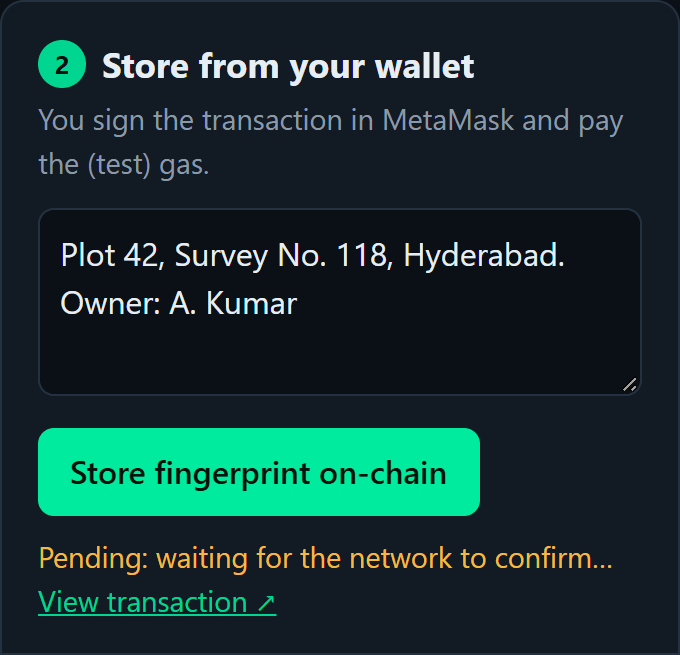 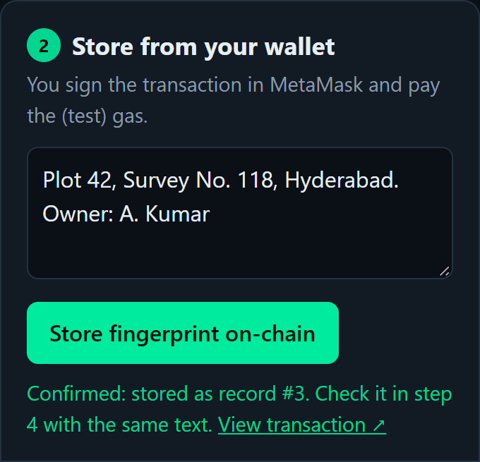

3. **Ask the AI** fills in a decision (a demo answer if no `API_KEY` is set). **Store decision on-chain** has the backend sign and send it; the record appears in step 4.

    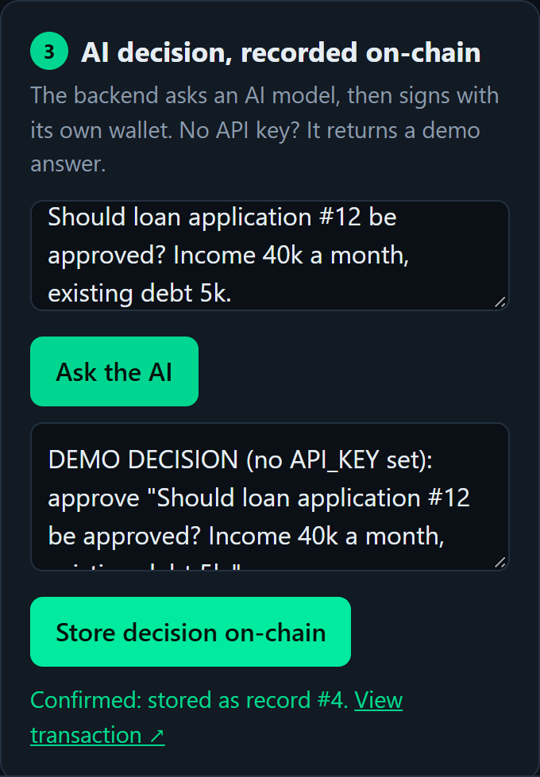

4. **Verify** re-hashes the text in your browser and checks it against the chain. Use **Check any record by id** for records stored from your wallet.

    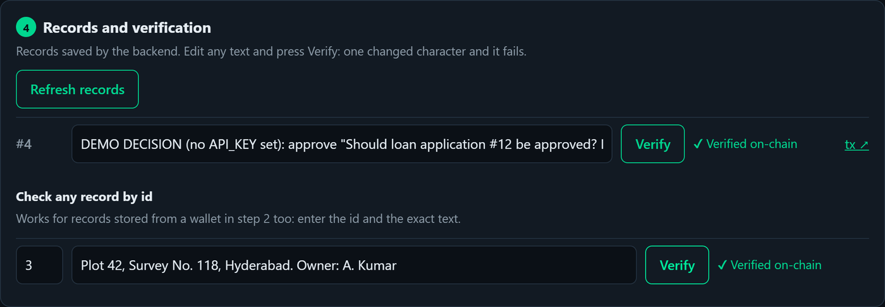

    Change one character and verify again: it fails. That's the whole point, and a strong moment for your demo.

    

If the page shows a yellow banner, `CONTRACT_ADDRESS` in `config.js` is still the placeholder:

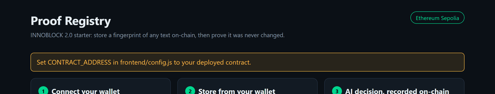

### Step 5 · Make it yours

Keep the parts you need, replace the rest. The two changes almost every team makes:

#### Change the contract

1. Edit the contract in Remix, compile, deploy again.
2. Copy the **ABI** (compiler tab → ABI button at the bottom) into `backend/abi.json`.
3. Update `CONTRACT_ABI` in `frontend/config.js` (human-readable lines, like the ones there).
4. Update `CONTRACT_ADDRESS` in **both** `backend/.env` and `frontend/config.js`.
5. Update the calls in `backend/app.py` and `frontend/app.js`.

#### Use a real AI model

Set `API_KEY`, `AI_BASE_URL` and `AI_MODEL` in `.env` (provider examples are in `.env.example`) and restart the backend. Change `AI_SYSTEM_PROMPT` to fit your domain, for example *"You are a loan officer. Reply APPROVE or REJECT and one reason."*

### Step 6 · Deploy

Follow [03 · Deploy and security](03-deploy-and-security.md). **Done when** the full flow works on the live URL from a teammate's phone (inside the MetaMask app's browser).

### Step 7 · Freeze and ship

Stop adding features a couple of hours before the build day ends. Then: README (overview, architecture, setup, env table, how to test, contract and live links, team), a 1–2 minute backup demo video, slides, and two timed rehearsals. See [05 · Pitch and judging](05-pitch-and-judging.md).

## AI prompt templates

AI coding assistants are allowed: Cursor, GitHub Copilot, ChatGPT, Gemini, any of them. Fill in the lines in `<angle brackets>`, paste the whole prompt, and build one step at a time.

> **Judges will ask how your code works.** If the AI writes something you don't understand, ask it to explain that part line by line before you move on.

### Template A · Build on this starter (recommended)

Open the cloned repo in your AI tool, then paste:

```text
/goal

I cloned the INNOBLOCK 2.0 starter. Read README.md and docs/02-build.md
first, then turn it into a dApp called "<PROJECT NAME>" for the <DOMAIN> track.

PROBLEM:      <the problem statement you were given, in one sentence>
CORE FEATURE: <what the user does, step by step, in 2-3 lines>
ON-CHAIN:     <exactly what is stored or emitted on the blockchain>
OFF-CHAIN:    <what stays in the backend or database>
NETWORK:      <Ethereum Sepolia | Base Sepolia | Polygon Amoy | Arbitrum Sepolia | OP Sepolia>

KEEP
- The folder structure: contracts/, backend/, frontend/
- Flask + web3.py backend, settings from backend/.env, never hardcode secrets
- Plain HTML/JS frontend with ethers.js v6, all settings in frontend/config.js
- Transaction status (pending / confirmed / failed) with an explorer link for every tx
- Friendly errors for: no wallet, user rejected, insufficient funds, wrong network
- JSON errors from the backend, never a stack trace

CHANGE
1. contracts/: adapt RecordRegistry.sol (or replace it) for my idea.
   Under 50 lines, no complex logic, an event for every state change,
   a comment on every function.
2. backend/app.py: adapt the routes. Update abi.json from the new contract.
3. frontend/: adapt the page to my user flow. Update CONTRACT_ABI in config.js.
4. README.md: rewrite it for my project: overview, why blockchain,
   architecture, setup, env variable table, how to test on the testnet,
   contract address with explorer link, live URL, team.

CONSTRAINTS
- Simple, readable code for beginners; comment every function
- Testnet only
- Work in small steps: contract, then backend, then frontend.
  After each step, tell me exactly how to test it before moving on.
```

### Template B · From scratch

If your team doesn't use the starter:

```text
/goal

Build a complete full-stack dApp called "<PROJECT NAME>" for the <DOMAIN>
track at the INNOBLOCK 2.0 hackathon.

PROBLEM:      <the problem statement you were given, in one sentence>
CORE FEATURE: <what the user does, step by step, in 2-3 lines>
ON-CHAIN:     <exactly what is stored or emitted on the blockchain>
OFF-CHAIN:    <what stays in the backend or database, if anything>
NETWORK:      <testnet name and chain ID>

1. SMART CONTRACT (Solidity ^0.8.20)
   - Deploy on <NETWORK> using Remix
   - Under 50 lines, no complex logic
   - Emit an event for every state change; comment every function

2. BACKEND (Python, Flask, web3.py)
   - Read PRIVATE_KEY, RPC_URL, CONTRACT_ADDRESS, EXPLORER_URL, API_KEY from .env
   - Never hardcode secrets; add .env.example and a .gitignore that excludes .env
   - Enable CORS for the frontend origin (flask-cors)
   - GET /health returns {"ok": true}
   - Clear JSON errors with a status code, never a stack trace
   - requirements.txt including gunicorn; start command: gunicorn app:app

3. FRONTEND (index.html + app.js + config.js + style.css, ethers.js v6 from a CDN)
   - Connect a wallet via window.ethereum and show the address
   - Switch the wallet to <NETWORK> with wallet_switchEthereumChain,
     adding it with wallet_addEthereumChain if needed
   - Show transaction status: pending / confirmed / failed
   - Link every transaction to the block explorer
   - Friendly messages for: no wallet, user rejected, insufficient funds, wrong network

4. FOLDER STRUCTURE
   project-name/
   ├── contracts/
   ├── backend/
   ├── frontend/
   └── README.md

5. README.md: overview, why blockchain, architecture diagram (text is fine),
   setup steps, env variable table, how to test on the testnet,
   contract address with explorer link, live URL, team members.

CONSTRAINTS
- Simple, readable code for beginners; comment every function
- Testnet only
- Work in small steps: contract, then backend, then frontend.
  After each step, tell me exactly how to test it before moving on.
```
