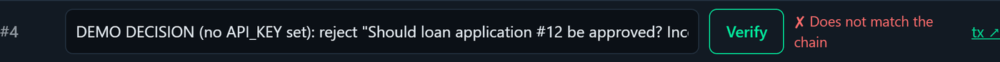

# 05 · Pitch and judging

A working demo on a testnet carries the most weight, so get the minimum working before anything fancy.

## Judging criteria

| Criterion | Marks | What judges look for |
| --- | ---: | --- |
| **Working prototype & codebase** | 30 | The live demo works end to end on a testnet; transactions are visible on the explorer; no hard-coded fakes; the code in the repo is what runs, and it's readable with error handling |
| **Blockchain** | 25 | The chain is needed, not decorative; a sensible on-chain / off-chain split; the contract is verified on the explorer |
| **Technical quality (GitHub, README, smart contract)** | 15 | A clean public repo with no secrets in its history; a complete README (setup, how to test, contract and live links); a readable, commented smart contract |
| **Pitch and Q&A** | 15 | How well you understood the problem statement you were given and explain your solution to it, on time; every member can answer questions about their own part |
| **Innovation** | 10 | A fresh angle; AI or other integrations that add real value |
| **UI / UX** | 5 | Easy to follow; clear transaction status and feedback |
| **Total** | **100** | |

## Pitch structure (3 minutes)

Plan for 3 minutes plus questions; the exact slot length is confirmed on Day 1.

| Time | Say / show |
| --- | --- |
| 0:00 – 0:20 | **Hook.** Your problem statement in one sentence, with a real example of who it hurts |
| 0:20 – 0:50 | **Solution.** What you built, and why it needs a blockchain |
| 0:50 – 2:20 | **Live demo.** One happy path, ending on the explorer page |
| 2:20 – 2:45 | **How it works.** One architecture slide |
| 2:45 – 3:00 | **What's next**, and the team |

## Slides: five or six, no more

1. **Title**: project name, team, domain, contract address
2. **Problem**
3. **Solution**
4. **Architecture** (the diagram in [02 · Build](02-build.md#how-the-starter-works) is a good base)
5. **Demo**, or a QR code to the live app
6. **What's next**

## Demo tips

- Start with the wallet **already connected and funded** and the backend already awake.
- Zoom the browser to 125–150% so the back row can read it.
- Keep demo inputs in a notes file and paste them; don't type live.
- Show the **explorer page** for a transaction: it's the proof that it's real.
- The tamper test makes a strong moment: change one character, press Verify, watch it fail.

    

- If the live demo breaks, switch to the backup video within 15 seconds. Skip the long apology.

## Questions to prepare for

- Why a blockchain and not just a database?
- What exactly is on-chain, and what isn't? Why?
- What does one transaction cost, and who pays for it?
- What happens if your backend goes down?
- How do you stop someone writing fake data to your contract?
- What would change to run this on mainnet?
- Who is your user, and why would they switch to this?

## Demo day checklist

- [ ] Frontend deployed and accessible: open it on a phone, on mobile data
- [ ] Backend awake: ping `/health` just before you present
- [ ] Database connected: a record created this morning still loads
- [ ] Environment variables set on Render and Vercel, not only on your laptop
- [ ] HTTPS on every URL (automatic on these platforms)
- [ ] Full flow tested **30 minutes** before your slot
- [ ] Local backup running: backend on `localhost:5000`, frontend on `localhost:8000`, with `BACKEND_URL` ready to switch
- [ ] Demo wallet **and** backend wallet each hold test tokens
- [ ] Only one wallet extension enabled
- [ ] Tabs open: the app, the contract on the explorer, a past successful transaction, the slides
- [ ] Backup demo video (1–2 minutes) saved **offline** on the laptop
- [ ] Phone hotspot ready in case the Wi-Fi drops
- [ ] Laptop charged; charger and HDMI / USB-C adapter in hand
- [ ] Notifications off; browser zoomed in

## Submission checklist

- [ ] Public GitHub repo, with no `.env` anywhere in its history
- [ ] README: overview, why blockchain, architecture, setup, env variable table, how to test on the testnet, team
- [ ] Contract address with a link to its **verified** explorer page
- [ ] Live frontend URL and backend URL
- [ ] Demo video link
- [ ] Slides as PDF
- [ ] Team name, members and domain

**Where and when to submit is announced on Day 1.**
